## 寝室分配

### 2 号楼（男生）

| 寝室  | 成员                 |
| --- | ------------------ |
| 201 | [stu:cwy], [stu:cxy], [stu:gjx], [stu:jrq] |
| 202 | [stu:lpl], [stu:wz], [stu:lc], [stu:xyc] |
| 203 | [stu:xhl], [stu:wsy], [stu:mhj], [stu:tqy] |
| 204 | [stu:wyc], [stu:lxh], [stu:lqq] |
| 205 | [stu:yjr], [stu:xzn], [stu:zyj], [stu:zmz] |

初三住在一楼（10x）。

### 1 号楼（女生）

| 寝室 | 成员 |
|------|------|
| ? | [stu:kly], [stu:lyr] |
| ? | [stu:xmz], [stu:zjs], [stu:zfy] |

## 宿舍布局

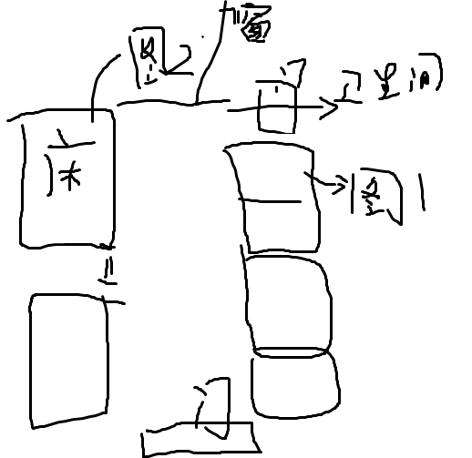

入住当日就发现座位上留着一把钥匙，大家探索后发现下方有四个并排的抽屉和柜子，各配锁孔。尝试后发现：寝室长钥匙只能开自己的抽屉，其余三个互不相通。

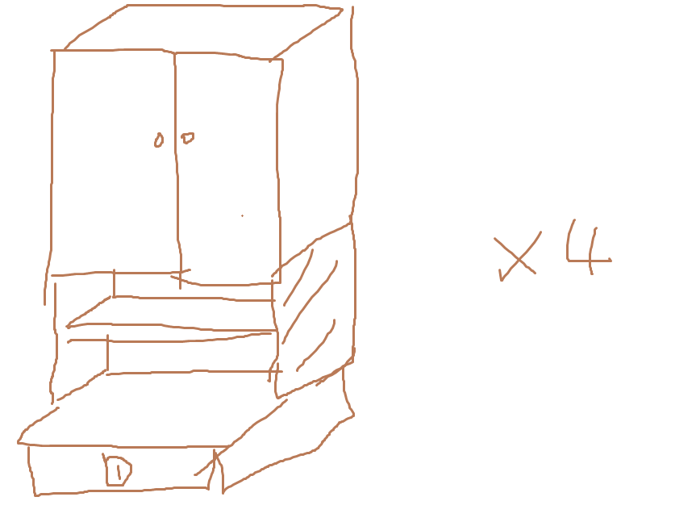

下铺床板没有粘胶，可以掀开。某日有室员意外掀开，遂成典故，史称"助我破鼎"。

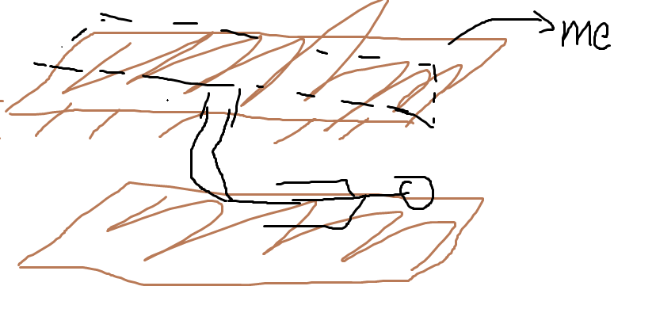

## 卫生间

卫生间里有很多神奇的事情。

布局如下：

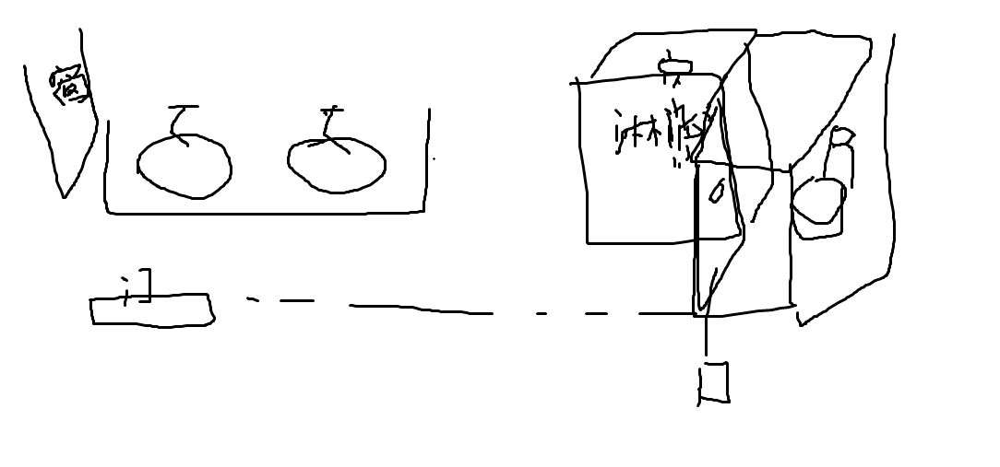

### 门锁传奇

卫生间的两个门大有文章。

#### 卡槽法

门板中央有块透视区，但锁比较特殊——正面有一凹槽，用硬币（得是一分钱才行，一毛钱比较难卡）或指甲（有概率搞坏指甲）卡进去旋转，就能从外面打开。

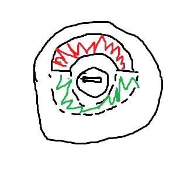

#### 攀爬法

[stu:xyc]后来发明了攀爬法——先爬、再翻、再落，进去开门，效果一样。不过对技术要求较高。

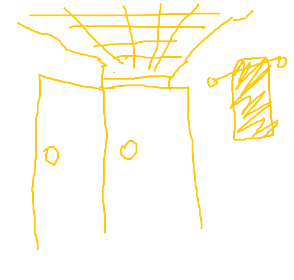
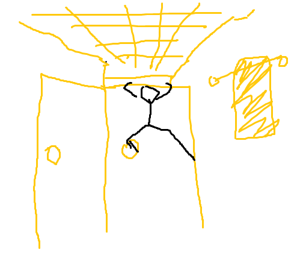
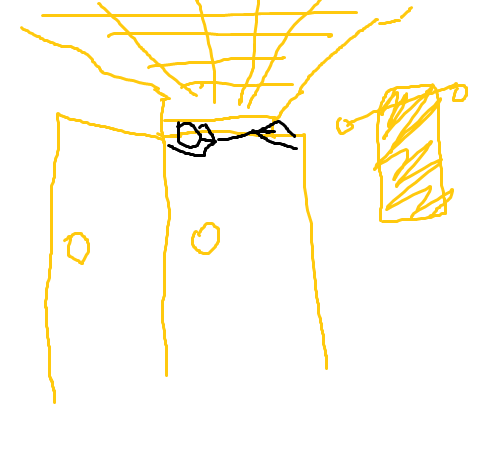
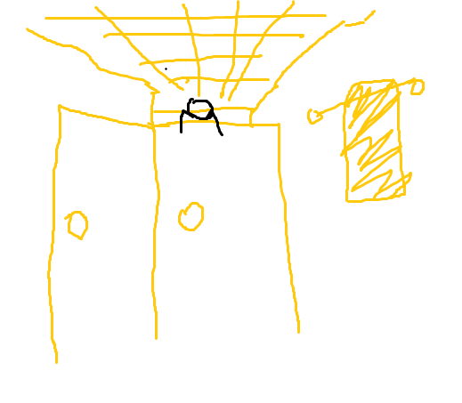

### 拆门法

[stu:wyc]还发现门用的是“三铰链锁”，结构不稳，门板可以整扇卸下来，夜间在厕所使用，称”门板开夜车”（当然实际大家都会拖个椅子进去）。

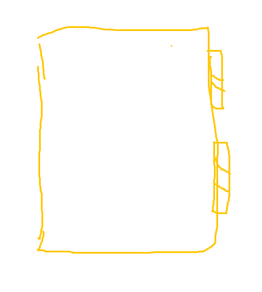
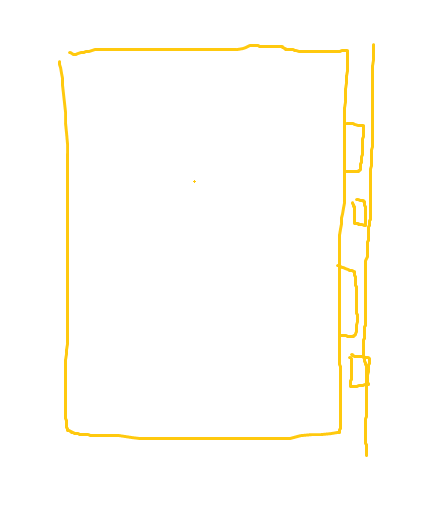
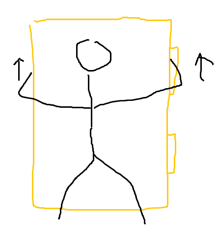

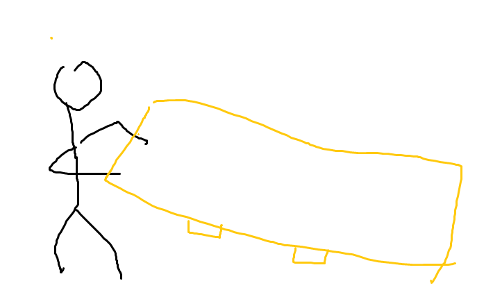

### 天花板

关门时会产生共振？或气压问题，结果：天花板呈波浪形抖动。

天花板坑自行脱落。虽然报修过，重新装上也还是掉下来了，现在一直空着。

掉下来的天花板很油，感觉像轻质金属，不知道是铝铁合金还是啥的。

2026 年 4 月 23 日，更有灯连着线从天花板上掉落，引发一阵惊呼。

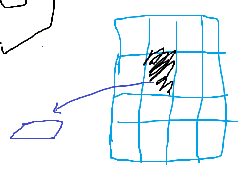

### 通风口

卫生间里有通风口通向隔壁卫生间，有人曾通过这个通风口跟初三对传过纸条、沟通。（补充 by 匿名）

## 宿管

2 号楼宿管有两个，一男一女。

宿管阿姨最近在跟豆包学唱歌和英语。

宿管住在 1 楼。

每一层有一个房间宿管可以待。1 楼的这个房间比较特殊，里面有电闸、冰箱、吹风机、饮水机、热水壶等，是宿管经常待的地方。

## 熄灯与夜车

21:50 熄灯。22:00 无热水。

宿管会时不时来看。但是频率不是很高。

有人直接光明正大在晚上开灯学习，称为“开夜车”。

也有人直接摸黑聊天，称为“夜聊”。

## 卫生规则

寝室卫生规则被编成：**书架上只能有书，垃圾桶里不能有垃圾，马桶里不能有屎**。

违反一次卫生规则 -0.5 分寝室分。纪律扣分（未关空调、夜聊等）-1 分寝室分，个人累计三次纪律扣分罚走读一天。

如果今天寝室分没扣就可以获得一颗星。寝室周从上一个周五到下一个周四，同一寝室周内获得 4 颗星可以加 0.2 分寝室分。

走读生同样要准时出早操，所以并不是什么好差事。
