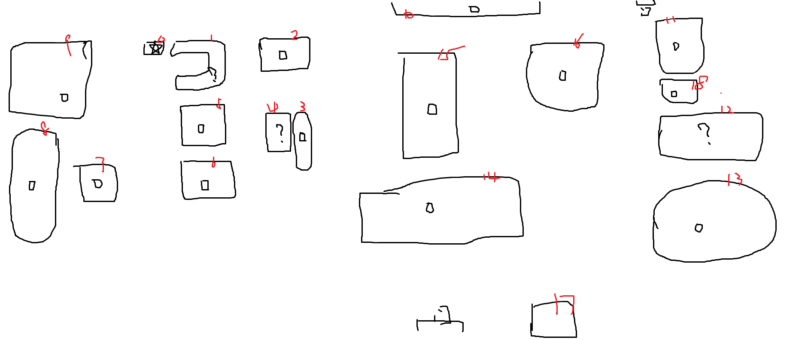

上海市上海中学，位于徐汇区。上海市排名前四的高中，是 T0 级别。特别是数学竞赛，全国顶尖。

星标为宿舍所在。问号表示暂无内容，方框表示有可叙之事。

## 建筑编号

| 编号 | 名称 | 说明 |
|------|------|------|
| 0 | 男生宿舍（2号楼） | 初二住 2 楼，初三住 3 楼 |
| 1 | 女生及部分男生宿舍（1号楼） | 初二高一女生和部分男生高一宿舍，从非正门进入，互相隔开 |
| 2 | 食堂 | 本部仅一座食堂，有二楼。一楼有饮料、快速套餐（早/中）、面档（大馄饨/面/中午）、麻辣烫（冬令时晚上有时有） |
| 3 | 总务楼 | 音乐教室和医务室（活跃 6:20–19:10，之外不开，也是销假处） |
| 4 | 小足球场 | 两个独立片区，中午下午常有人踢球 |
| 5 | 游泳馆（1 楼）/ 乒乓房（3 楼） | 游泳课所在地；乒乓房台子多，是乒羽班日常训练地 |
| 6 | 图书馆 | 很多人自习的地方。有电脑（需登记，苹果系统无还原盘，不好用） |
| 7 | 体育馆 | 室内篮球场，附带飞镖室、体操房和乒乓房（小但有发球机） |
| 8 | 操场 | 跑道和大足球场，穿过后到西区 |
| 9 | 室外篮球场 | 平时早操在此 |
| 11 | 甄陶楼 | 高一教学楼、线上数拓所在地，有报告厅 |
| 12 | 红楼 | 校领导办公区 |
| 13 | 逸夫楼 | 物化生实验室、机房 |
| 14 | 龙门楼 | 初二初三与高三教学楼，数学小班所在地 |
| 17 | 罗森便利店 | 校内便利店，开放时间 12:00–18:55 |
| 18 | 工程楼 | STEM 课所在地 |
